# Proyecto-HTML
# creacion de carpetas del proyecto

comenzamos creando las carpetas y archivos para el funcionamiento del proyecto
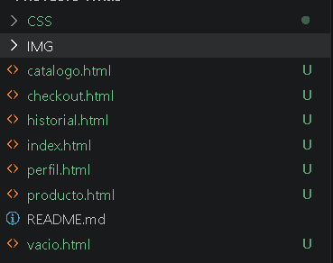

# creacion de index.html 

se creao el index.html para inicio del funcionamiento

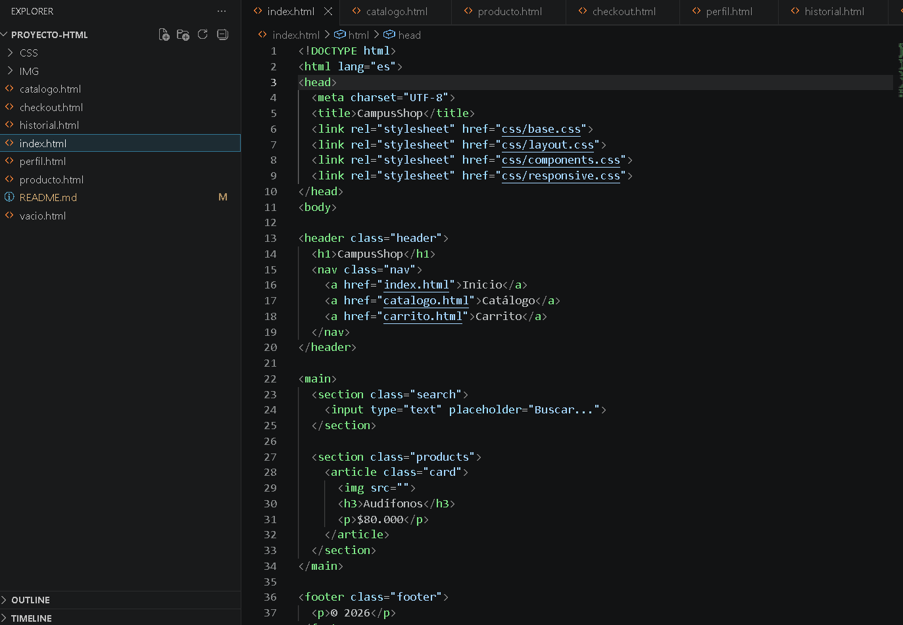

# creacion del catalogo.html

se creo el catalogo.html para seguir con el funcionamiento de la pagina

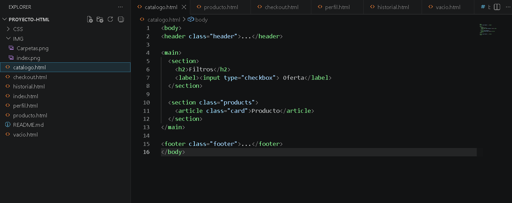

# creacion del producto.html

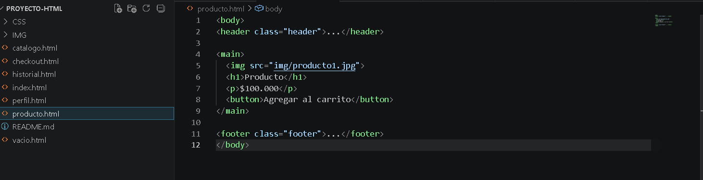

# creacion del carrito.html

se creo el carrito.html para continuar con el funcionamiento

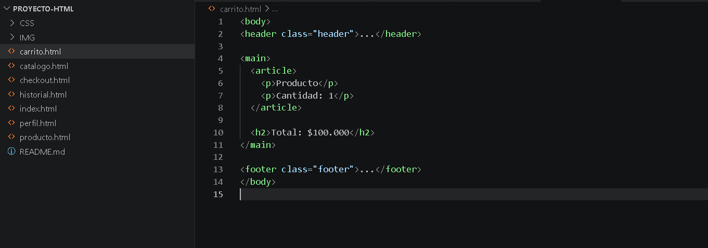

# creacion del checkout.html

se creo el checkout.html para seguir modificando para el funcionamiento de la pagina

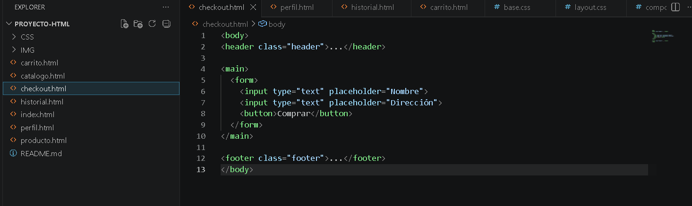

# creacion del checkout.html

se creo el prefil.html listo para seguir en el proceso que funcione la pagina

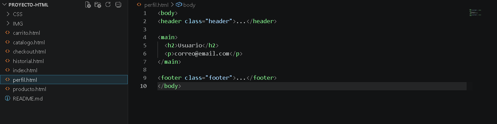

# creacion del historial.html

creacion del vacio.html para seguir con los htmls

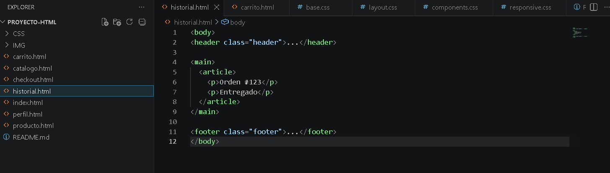

# creacion del vacio.html

se creo el vacio.html para la termiancion de creacion de todos los htmls 

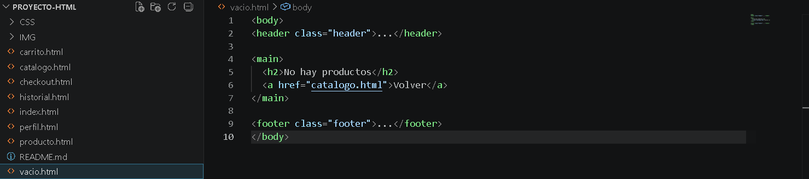

# creacion de base.css

se creo el base.css para el comienzo de los css

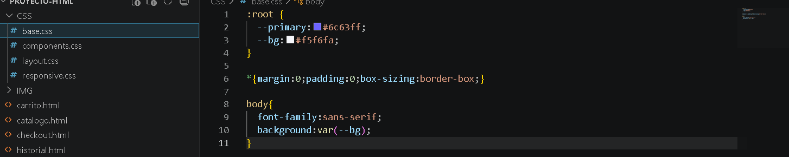

# creacion layout.css

se creo el layaut.css para el proceso de los css

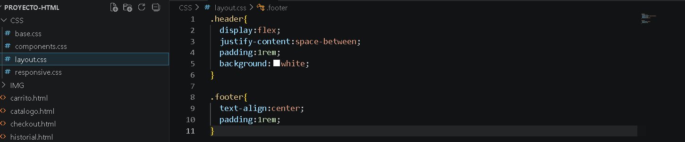

# creacion de components.css

se creo los components.css para seguir con el proceso del proyecto

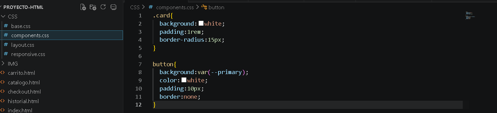

# creacion de responsive.css

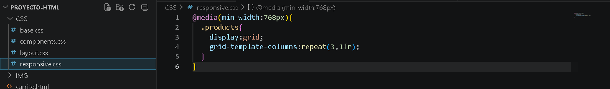
